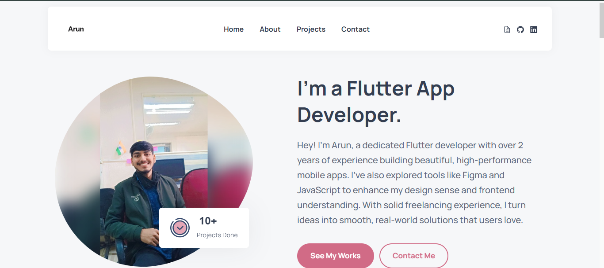

# Arun's Personal Portfolio Website

A clean, modern, and fully responsive personal portfolio website designed to showcase my skills and projects as a Flutter App Developer. The design is inspired by elegant, minimalist principles and is built from the ground up with pure HTML, CSS, and a touch of vanilla JavaScript.

---

## ✨ Key Features

-   **Fully Responsive Design:** Looks great on all devices, from mobile phones to widescreen desktop monitors.
-   **Two-Page Layout:**
    -   A main **landing page** (`index.html`) with a hero section, "About Me," featured projects, and a contact form.
    -   A dedicated **"All Projects" page** (`project.html`) with a beautiful grid layout for showcasing my entire body of work.
-   **Interactive Project Cards:**
    -   Elegant project cards with a clean separation of the logo and content.
    -   A unique "click-to-reveal" feature that transforms a "See Project" icon into animated, direct links to the Play Store and App Store.
-   **Dynamic Theming:** Card backgrounds and interactive elements use a predefined, soft color palette that can be easily customized. The store link icons automatically inherit an accent color from their parent card for a cohesive look.
-   **Clean Navigation:** A theme-matching "Back to Home" button on the projects page ensures a smooth user experience.
-   **Built with Web Standards:** No frameworks, just semantic HTML5, modern CSS3 (Flexbox, Grid, Custom Properties), and lightweight JavaScript for interactivity.

---

## 🚀 Built With

This project was built using the following technologies:

-   **HTML5:** For the core structure and content.
-   **CSS3:** For all styling, layout, and animations.
    -   **Flexbox & Grid:** For creating robust, responsive layouts.
    -   **Custom Properties (Variables):** For easy theming and color management.
    -   **Transitions & Animations:** For smooth hover effects and interactive elements.
-   **Vanilla JavaScript:** For handling DOM manipulation, such as the interactive project links and mobile navigation.
-   **Google Fonts:** For elegant and readable typography (`Playfair Display` and `Lato`).
-   **IonIcons:** For clean and scalable icons used throughout the site.

---

## 📂 Folder Structure

The project is organized with a clean and intuitive folder structure.